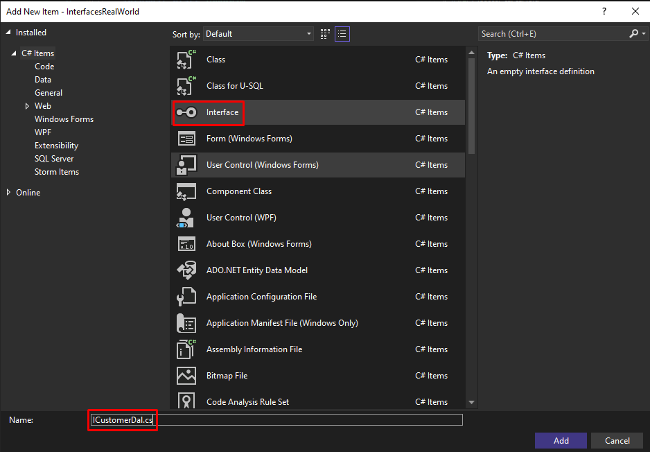

---

Gerçek uygulamalarda interface farklı implementasyonlar için kullanılır. Örneğin, biz SQL Server, ve Oracle destekli bir sistem yazmak istiyoruz. Her ikisi için de kullanacağımız teknoloji farklıdır. Bu nedenle ICustomerDal ‘ı SQL için ayrı Oracle için ayrı implemente etmemiz gerekir. 

Bu bakımdan…

Veri tabanına ekleme işlemi yaptığımızı düşünelim…

SQL Server’ı kullanırsak SQL Server’a Oracle’ı kullanırsak Oracle’a bağımlı kalırız.

Fakat aşağıdaki gibi interface kullanırsak…

Yukarıdaki gibi ICustomerDal tipinden parametre alırız.

Bu sayede kullanılan veri tabanını değiştirdiğimizde aşağıdaki kırmızı alanı değiştirmemiz yeterli olacaktır…

Özetle…

<aside>

📌 Interface ‘ler gerçek hayat uygulamalarında bu şekilde katmanlar arasında geçişlerde yoğun ölçüde kullanılır. Burada amaç uygulamanın bağımlılıklarını minimize indirmektir.

</aside>

---

Bu şekilde method parametresi olarak verdik fakat ilerleyen bölümlerde burası constructor ile yapılacak…

---

# Other

DAL (Data Access Layer) → Veri işlerini yapmak için kullanılan sınıftır.