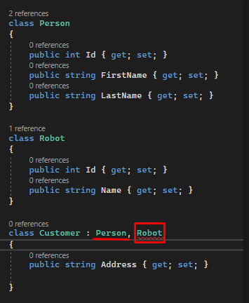

# Inheritance

Yukarıdaki örnek hatalıdır.

<aside>

📌 Bir class, sadece tek bir class’dan miras alabilir.

</aside>

Yukarıdaki örnek hatasızdır.

<aside>

📌 Bir Class birden fazla interface alabilir.

</aside>